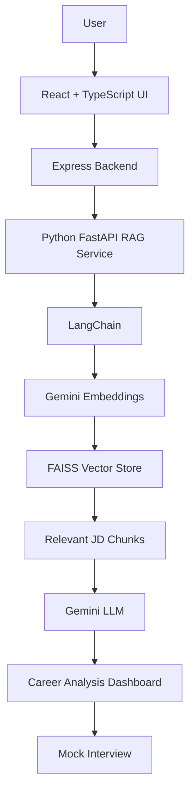

# 🚀 CareerLens AI

> **RAG-Powered Resume Analysis & Personalized Career Advisor**

[](https://react.dev/)
[](https://fastapi.tiangolo.com/)
[](https://python.langchain.com/)
[](https://github.com/facebookresearch/faiss)
[](https://ai.google.dev/)
[](https://expressjs.com/)

---

## 📌 Project Overview

**CareerLens AI** is an intelligent, GenAI-driven career advisor and interview preparation system designed to bridge the gap between candidate resumes and modern hiring requirements. Powered by **Retrieval-Augmented Generation (RAG)**, **LangChain**, **FAISS vector search**, and **Google Gemini**, CareerLens AI conducts an in-depth semantic evaluation of a candidate's profile against any target Job Description (JD).

Instead of surface-level keyword counting, CareerLens AI embeds, indexes, and semantically matches resume competencies against job requirements to provide:

- 📊 **Resume-JD Match Score**: An objective, grounded compatibility score (0–100%) calculated from vector similarity and context analysis.
- 🎯 **Matching Skills**: Identified hard and soft skills present in the resume that directly satisfy JD requirements.
- ⚠️ **Skill Gaps**: Missing competencies, frameworks, or domain requirements prioritized for upskilling.
- 🏷️ **ATS Keywords**: Essential keywords and industry terms required to pass automated Applicant Tracking Systems.
- 💡 **Resume Improvement Suggestions**: Actionable, impact-driven bullet point enhancements with strong action verbs and quantified metrics.
- 🎯 **Interview Focus Areas**: High-priority technical and behavioral topics tailored to target role expectations.
- 🔍 **RAG Retrieval Evidence**: Live vector inspection console showing the exact JD chunks retrieved with relevance metrics.
- 🎙️ **AI Mock Interview Preparation**: Interactive AI interviewer providing real-time questioning, voice transcription, feedback, and performance scoring.

---

## 🎯 Problem Statement

In today's competitive job market, candidates face significant obstacles:
1. **Manual & Inefficient Resume Tailoring**: Job seekers spend hours manually comparing their resumes against complex job descriptions without knowing which requirements matter most.
2. **Opaque ATS Systems**: Automated Applicant Tracking Systems filter out qualified candidates due to missing keywords, non-standard phrasing, or suboptimal formatting.
3. **Superficial Feedback**: Existing resume review tools perform simplistic string matching, missing semantic nuances (e.g., recognizing that "PyTorch + CUDA" maps to "Deep Learning experience").
4. **Disconnected Interview Prep**: Candidates analyze their resume in one tool, search for interview questions in another, and lack a unified pipeline that connects resume gaps directly to targeted mock interview practice.

---

## 💡 Solution

**CareerLens AI** delivers an end-to-end, contextual career guidance engine by combining:
- **Semantic Vector Retrieval (RAG)**: Job descriptions are dynamically chunked and converted into vector embeddings using Google Gemini (`gemini-embedding-001`), indexed inside an in-memory **FAISS** vector store.
- **Contextual Grounding**: When a resume is analyzed, LangChain performs similarity search to retrieve the most relevant JD requirements, passing them as grounded context to Google Gemini.
- **Intelligent Synthesis**: Gemini LLM generates structured insights covering match percentages, skill alignment, ATS optimization, and personalized resume rewrites without hallucinating requirements.
- **Unified Mock Interview Workflow**: The extracted skill gaps and interview focus areas immediately feed into an interactive AI Mock Interview session, testing the candidate on their exact growth areas with real-time feedback and evaluation reports.

---

## ✨ Key Features

- 📄 **Resume Analysis** — Robust parsing of plain text and PDF resumes, extracting experience, core competencies, and project history.
- 📋 **Job Description Analysis** — Intelligent parsing and semantic segmentation of job postings into actionable requirement units.
- 🔍 **RAG-Based Requirement Retrieval** — High-precision retrieval of relevant job criteria based on candidate background queries.
- ⚡ **FAISS Vector Search** — Fast in-memory dense vector indexing and cosine similarity retrieval.
- 🎯 **Resume-JD Matching** — Grounded compatibility scoring reflecting both technical and experience alignment.
- 📊 **Skill Gap Analysis** — Clear categorization of matched strengths versus missing role requirements.
- 🏷️ **ATS Keyword Recommendations** — Suggested keywords and skills formatted for direct integration into resumes.
- 💡 **Resume Improvement Suggestions** — Concrete recommendations for rewriting resume bullets to demonstrate quantifiable impact (e.g., STAR method).
- 🎯 **Interview Focus Areas** — Tailored subject-matter recommendations highlighting what recruiters are most likely to ask.
- 🎙️ **AI Mock Interview** — Interactive voice/text interview simulator with role-specific questions and dynamic follow-ups.
- 📈 **AI Interview Evaluation** — Comprehensive scorecards detailing communication, technical depth, and actionable advice.
- 🔬 **Visible RAG Retrieval Evidence** — Interactive transparency panel showcasing retrieved chunk previews, scores, and metadata.

---

## 🏗️ System Architecture

The following diagram illustrates the multi-tier architecture powering CareerLens AI:



### 🔄 Data & Execution Flow
1. **User Input**: Candidate submits resume text/PDF and target job description via the React dashboard.
2. **Orchestration**: Node.js/Express backend delegates the analysis payload to the Python FastAPI RAG microservice (`POST /analyze`).
3. **Chunking & Indexing**: LangChain `RecursiveCharacterTextSplitter` segments the JD into semantic chunks; Gemini embeddings are generated and stored in a FAISS vector index.
4. **Retrieval**: Candidate resume context queries the FAISS index to retrieve the top $k$ most relevant job requirement chunks.
5. **Synthesis & Grounding**: Google Gemini LLM processes the grounded prompt and returns a validated, structured JSON schema.
6. **Dashboard & Interview**: Results populate the interactive analytics UI, allowing candidates to view metrics, inspect RAG evidence, and jump straight into an AI mock interview.

---

## 🛠️ Tech Stack

| Domain | Technology / Library | Purpose |
| :--- | :--- | :--- |
| **Frontend UI** | **React 19**, **TypeScript**, **TailwindCSS** | High-performance interactive UI, animated dashboards, responsive views |
| **Icons & Animation** | **Lucide React**, **Motion** | Modern iconography and smooth micro-interactions |
| **Web Server / Backend** | **Node.js**, **Express**, **tsx**, **Vite** | API gateway, session routing, proxying, and client serving |
| **RAG Microservice** | **Python 3.9+**, **FastAPI**, **Uvicorn**, **Pydantic** | Dedicated high-throughput vector retrieval and AI inference service |
| **RAG & Vector Search** | **LangChain**, **FAISS (`faiss-cpu`)** | Document chunking, vector indexing, dense retrieval, and prompt chains |
| **AI Models** | **Google Gemini (`gemini-3.5-flash` / `gemini-2.5-flash`)** | Large language model for career analysis and mock interview generation |
| **Embedding Models** | **Google Gemini Embeddings (`gemini-embedding-001`)** | High-dimensional semantic vector representations |

---

## 🔬 Deep Dive: How RAG Works in CareerLens AI

```
┌─────────────────┐       ┌──────────────────────────────┐
│ Job Description │ ───>  │ Recursive Character Splitter │
└─────────────────┘       └──────────────┬───────────────┘
                                         │ Chunks
                                         ▼
                                  ┌──────────────┐
                                  │ Gemini Embed │
                                  └──────┬───────┘
                                         │ Vectors
                                         ▼
                               ┌───────────────────┐
                               │ FAISS Vector Store│
                               └─────────┬─────────┘
                                         │ Top-K Semantic Chunks
┌─────────────────┐                      ▼
│ Candidate Resume│ ───> Query ───> ┌─────────────┐       ┌──────────────────────┐
└─────────────────┘                 │ Grounded    │ ───>  │ Structured Analysis  │
                                    │ LLM Prompt  │       │ & Career Advice JSON │
                                    └─────────────┘       └──────────────────────┘
```

1. **Document Chunking**: Job descriptions are split using `RecursiveCharacterTextSplitter` (chunk size: 300 characters, overlap: 50 characters) to preserve context boundaries across requirements, responsibilities, and qualifications.
2. **Vector Embeddings**: Each chunk is transformed into dense vector representations via Google Gemini's Embedding API (`models/gemini-embedding-001`).
3. **Similarity Search**: The candidate's resume summary and experience are transformed into query vectors. FAISS executes L2/cosine similarity search to isolate the most relevant requirement chunks ($k=5$).
4. **Structured Generation**: The retrieved chunks are supplied into a structured Pydantic-governed Gemini prompt, ensuring hallucination-free, factual comparisons.

---

## 🚀 Getting Started & Local Setup

Follow these step-by-step instructions to run the full CareerLens AI suite locally.

### 📋 Prerequisites
- **Node.js**: `v18.x` or higher ([Download Node.js](https://nodejs.org/))
- **Python**: `v3.9` to `v3.12` ([Download Python](https://www.python.org/))
- **Google Gemini API Key**: Obtain a free API key from [Google AI Studio](https://aistudio.google.com/).

---

### 1️⃣ Clone the Repository
```bash
git clone https://github.com/your-username/CareerLens-AI.git
cd CareerLens-AI/PrepSphere
```

---

### 2️⃣ Configure Environment Variables
Create a `.env` file in the project root:

```bash
cp .env.example .env
```

Ensure your `.env` contains your Gemini API key:
```env
# Google Gemini API Configuration
GEMINI_API_KEY="your_actual_gemini_api_key_here"

# Python FastAPI Microservice Endpoint
RAG_SERVICE_URL="http://127.0.0.1:8000"

# Optional Model Settings
GEMINI_MODEL="gemini-3.5-flash"
GEMINI_EMBEDDING_MODEL="models/gemini-embedding-001"
PORT=3000
```

> ⚠️ **Important**: Never commit `.env` or any sensitive API keys to GitHub or public repositories.

---

### 3️⃣ Start the Python FastAPI RAG Service

Open a new terminal window:

```bash
# Navigate to rag_service directory
cd rag_service

# Create and activate virtual environment
python3 -m venv .venv
source .venv/bin/activate    # On Windows use: .venv\Scripts\activate

# Install dependencies
pip install -r requirements.txt

# Start the FastAPI service
python main.py
```
*The RAG microservice will start at `http://127.0.0.1:8000` (Swagger docs available at `http://127.0.0.1:8000/docs`).*

---

### 4️⃣ Start the React & Express Application

Open a second terminal window:

```bash
# From the project root (PrepSphere directory)
npm install
npm run dev
```

*The web application will launch at `http://localhost:3000`.*

---

## 🧪 Verification & Demo Workflow

1. **Verify Services**:
   - RAG Health Check: `curl http://127.0.0.1:8000/health` → `{"status":"ok"}`
   - Node API Health Check: `curl http://localhost:3000/api/health` → `{"status":"ok"}`

2. **Run an Analysis**:
   - Open `http://localhost:3000` in your web browser.
   - Use the pre-populated demo data or upload your custom resume and paste a target job description.
   - Click **"Analyze Career Match"**.
   - Review match scores, skill comparisons, ATS recommendations, and resume improvements.
   - Expand the **"RAG Retrieval Evidence"** panel to inspect the exact FAISS-matched vector chunks.

3. **Start Mock Interview**:
   - Click **"Continue to Mock Interview"** to launch the interactive simulation tailored to your skill gaps.

---

## 📁 Project Directory Structure

```text
careerlens/
└── PrepSphere/
    ├── src/
    │   ├── components/
    │   │   ├── CareerMatchView.tsx       # RAG match dashboard, skill gaps & metrics
    │   │   ├── DashboardHeader.tsx       # Top navigation & system status
    │   │   ├── InterviewReportView.tsx   # Comprehensive post-interview scorecard
    │   │   ├── MockInterviewConsole.tsx  # Real-time voice/text AI interview console
    │   │   ├── ResumeUpload.tsx          # Resume text/PDF input & JD selector
    │   │   └── SetupSession.tsx          # Interview setup & difficulty selection
    │   ├── App.tsx                       # Main application state & view routing
    │   ├── types.ts                      # Shared TypeScript interfaces & models
    │   ├── main.tsx                      # React root entrypoint
    │   └── index.css                     # TailwindCSS stylesheet
    ├── rag_service/
    │   ├── main.py                       # FastAPI server, LangChain RAG & FAISS core
    │   ├── requirements.txt              # Python microservice dependencies
    │   └── .gitignore                    # Python venv & bytecode exclusions
    ├── server.ts                         # Node.js/Express backend & API gateway
    ├── package.json                      # Node dependencies & run scripts
    ├── vite.config.ts                    # Vite build & bundler configuration
    ├── tsconfig.json                     # TypeScript compiler options
    ├── .env.example                      # Sample environment variables template
    └── README.md                         # Project documentation
```

---

## 🔌 API Reference

### RAG Microservice (FastAPI)
- `GET /health` — Service health and readiness check.
- `POST /analyze` — Accepts resume and JD payload; executes chunking, FAISS vector search, and Gemini synthesis to return structured career analysis.

### Express Backend (Node.js)
- `GET /api/health` — Gateway status and Python service connectivity check.
- `POST /api/career/analyze` — Proxies request to RAG microservice with error fallback.
- `POST /api/chat` — Manages stateful mock interview dialogue and feedback turns.
- `POST /api/evaluate` — Generates end-of-interview report and grading.

---

## 🎓 Academic & Engineering Highlights

- **Grounding Against Hallucination**: Employs LangChain RAG to constrain the LLM's scoring and recommendations strictly to retrieved JD segments, preventing ungrounded claims.
- **Microservice Architecture**: Decouples compute-heavy vector indexing and embeddings in Python from the reactive, responsive React/Node user interface.
- **Full-Cycle Career Pipeline**: Seamlessly connects discovery (skill gap identification) to execution (interactive interview simulation).

---

## 📄 License

This project is open-source and available under the [MIT License](LICENSE).
